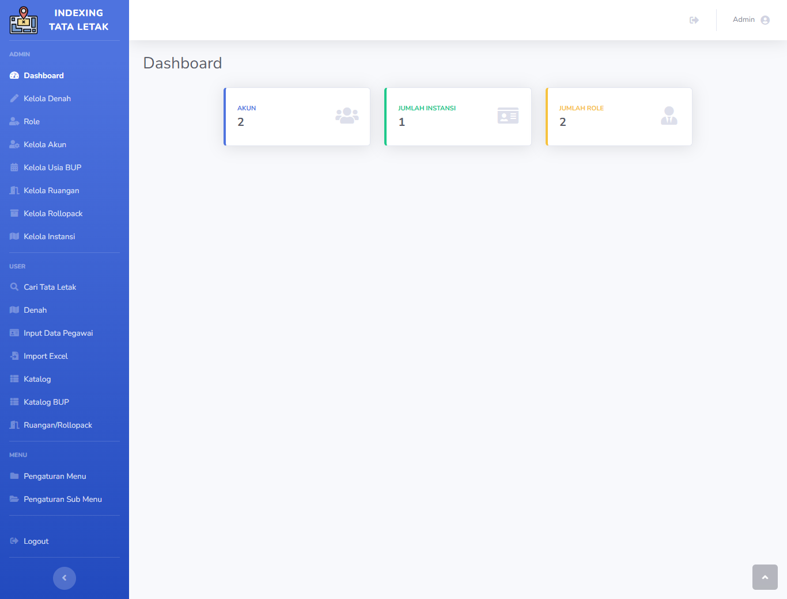
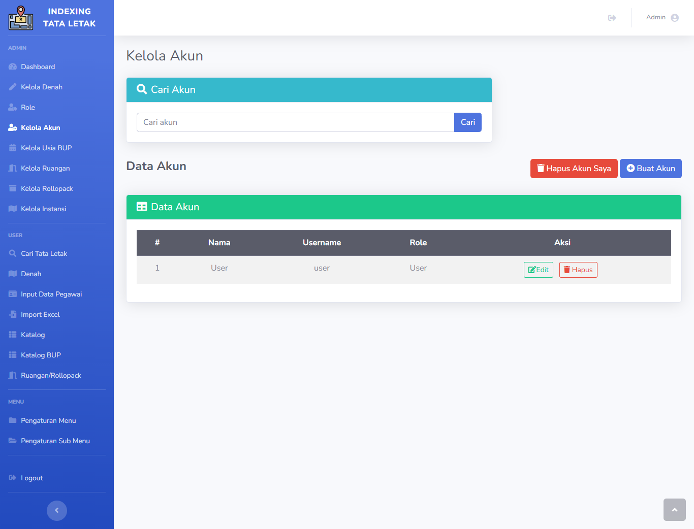
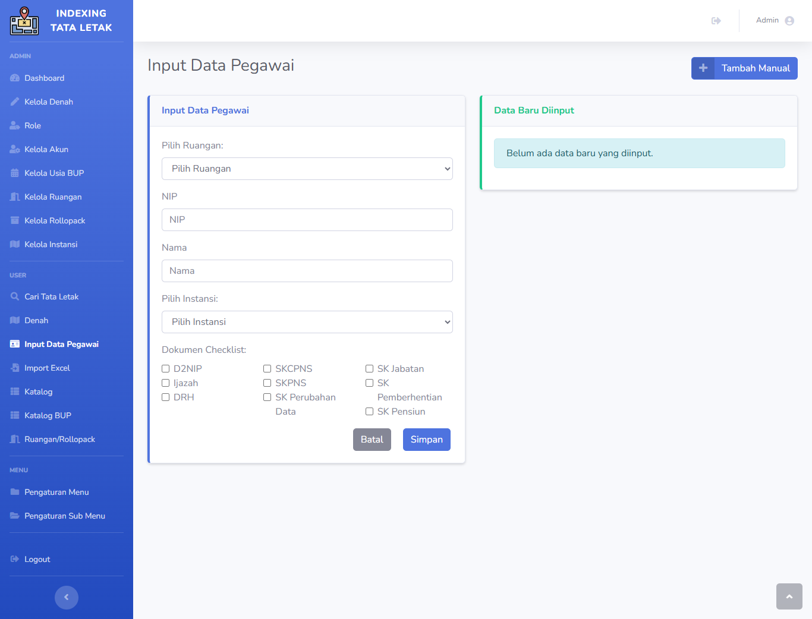
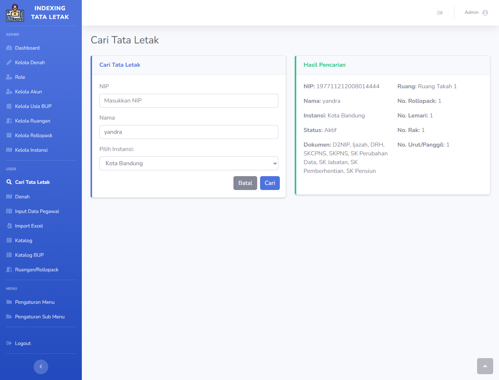

# Judul

**Sistem Informasi Takah**

---

## Deskripsi Singkat

Projek ini adalah sebuah **Sistem Informasi Takah** yang memiliki fitur utama berupa input data pegawai, pengindeksan otomatis nomor urut, serta pencarian lokasi dokumen. Sistem ini dirancang untuk memudahkan manajemen arsip dan pencarian dokumen dengan efisien menggunakan antarmuka berbasis web.

---

## Teknologi yang Digunakan

- **Framework**: CodeIgniter 3 (CI3)
- **Bahasa Pemrograman**: PHP versi 8.1
- **Frontend**: Bootstrap
- **Database**: MySQL

---

## Informasi Akun

### Akun Admin

- **Nama**: Admin
- **Username**: `admin`
- **Password**: `admin123`
- **Hak akses**: Memiliki hak akses penuh (menu admin dan user).

### Akun User (Pengguna Biasa)

- **Nama**: User
- **Username**: `user`
- **Password**: `user123`
- **Hak akses**: Hanya memiliki akses ke menu user.

---

## Gambar Projek

Berikut adalah beberapa tampilan dari Sistem Informasi Takah:

### 1. Dashboard Admin

### 2. Halaman Kelola Akun

### 3. Halaman Input Data Pegawai

### 4. Halaman Pencarian Dokumen

